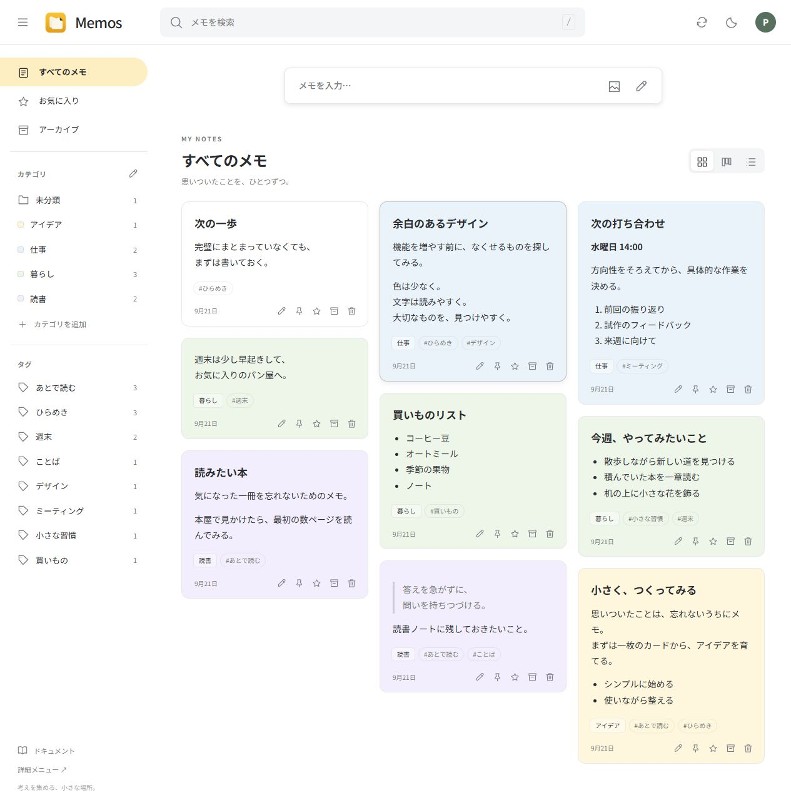
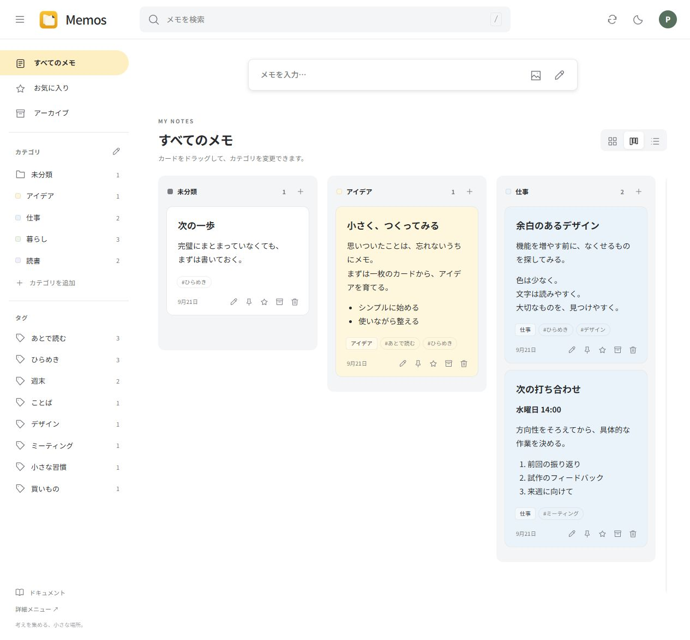

<p align="center"></p>

# Memos Worker — Keep-style notes

Google Keep のようにメモをカードで並べる、Cloudflare 上でセルフホストできるメモアプリです。
[souvenp/memos-worker](https://github.com/souvenp/memos-worker) をベースに、カテゴリ・タグ・自動保存・Cloudflare Access 認証を追加しています。

**[セルフホスト手順](docs/SELF_HOSTING.md)** · **[Local development](#ローカルで試す)** · **[上流の説明](docs/UPSTREAM.md)**

## スクリーンショット

以下はローカル環境の架空のサンプルメモです。個人のメモ、添付ファイル、アカウント情報は含めていません。

### カード表示



### カテゴリ別の列表示



## 主な機能

- カード・カテゴリ別の列・リスト表示。カテゴリ列へのドラッグで分類を変更。
- **カテゴリとタグを別管理**。カテゴリはメモごとに1つ、タグは複数。サイドバーの一覧と複合絞り込み。
- 本文の `#タグ` と、本文とは独立したタグ入力欄。
- **約2秒の入力停止で自動保存**。編集画面の外側クリック・閉じる・Esc でも保存。
- 保存に失敗した場合は入力を保持。保存中に編集した内容も続けて保存。
- Markdown、検索、お気に入り、上部固定、アーカイブ、画像・ファイル添付。
- Cloudflare Access で任意の認証プロバイダーを設定。Google、GitHub、メールのワンタイム PIN などから選べます。Worker でも JWT の署名・発行元・対象アプリ・期限・許可メールを検証。
- ライト・ダークテーマ。メイン画面にはカレンダーや統計カードを表示しません。
- 上流の詳細画面は `/classic`、ドキュメント機能は `/docs` に保持。

## 構成

| サービス | 用途 |
| --- | --- |
| Cloudflare Workers + Static Assets | API と画面 |
| D1 | メモ、カテゴリ、タグ、ドキュメント |
| R2 | 画像、添付ファイル |
| KV | 設定など |
| Cloudflare Access | 本番の認証（プロバイダーは各自で設定） |

単一オーナー向けの構成です。公開リポジトリにメモ本体や DB のバックアップは含まれません。ソースを取得しても、他の利用者のデータには接続しません。

## ローカルで試す

Node.js 22 以降を使用してください。

```sh
git clone https://github.com/daraskme/memos-worker.git
cd memos-worker
npm ci
cp .dev.vars.example .dev.vars
npm run db:local
npm run dev
```

PowerShell では `cp` の代わりに `Copy-Item .dev.vars.example .dev.vars`、必要なら `npm.cmd` を使います。

http://127.0.0.1:8787 を開き、`.dev.vars` のローカル専用アカウントでログインします。デフォルトは `demo` / `local-demo-only-change-me` です。本番では [Cloudflare Access で任意の認証方法を設定](docs/SELF_HOSTING.md)してください。

空のローカル DB に架空のサンプルを追加する場合は、サーバー起動中に別のターミナルで実行します。

```sh
npm run demo
```

サンプル投入スクリプトはループバック URL にのみ接続し、既存のメモまたはカテゴリがある場合は停止します。`npm run db:local` は新規 DB の初期化用で、既存 DB には繰り返し実行しません。

## 本番へのデプロイ

[docs/SELF_HOSTING.md](docs/SELF_HOSTING.md) に、Cloudflare リソース作成、認証プロバイダーの選択、Access ポリシー、DB 初期化、公開・更新の手順をまとめています。

共有用の `wrangler.toml` にはダミー ID のみを置き、実際の設定は Git 管理しない `wrangler.production.toml` に保存します。`.dev.vars`、ローカル DB、バックアップも Git 管理から除外しています。

## 検証

```sh
npm test
npm run check
```

認証の正常系・署名やメール等の不正値・古い Cookie による迂回拒否を検証し、Worker のビルドを確認します。GitHub Actions でも実行します。

## クレジット

ベース: [souvenp/memos-worker](https://github.com/souvenp/memos-worker)。上流のコミット履歴を保持した Fork です。

画面で配布する Marked / DOMPurify のライセンス文書は [docs/licenses](docs/licenses) にあります。アイコンは組み込み画像生成ツールで作成しました。[生成プロンプト](docs/icon-generation.md)

上流の取得時点ではリポジトリ全体の LICENSE ファイルはありませんでした。この Fork で上流コードに新たなライセンスを付与していません。
